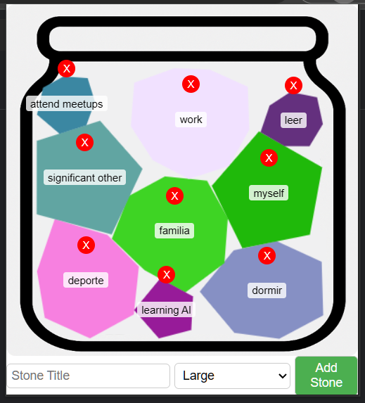

# jar-extension

Jar Extension es una extensión para Chrome que permite a los usuarios gestionar y visualizar "piedras" dentro de un tarro virtual. Los usuarios pueden añadir piedras con diferentes tamaños y colores, representando tareas o elementos personalizados, y organizarlas dentro del tarro interactivo.

